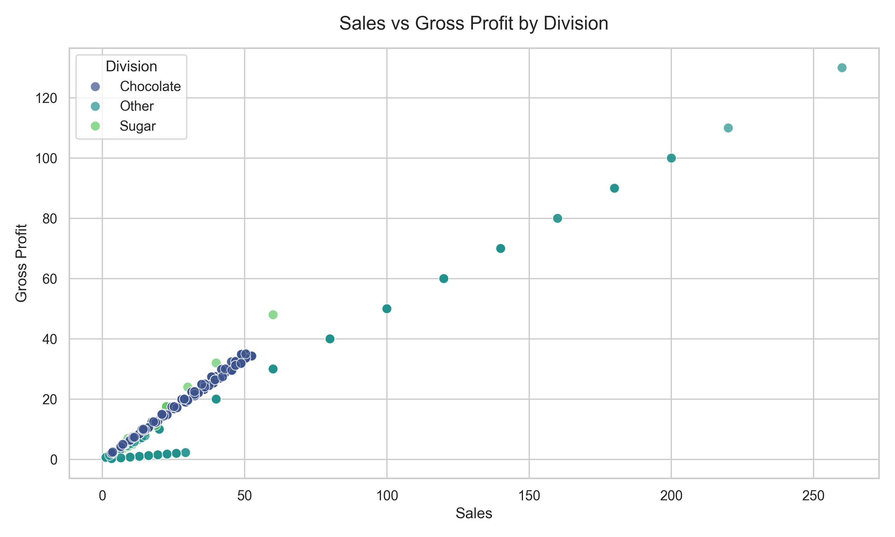
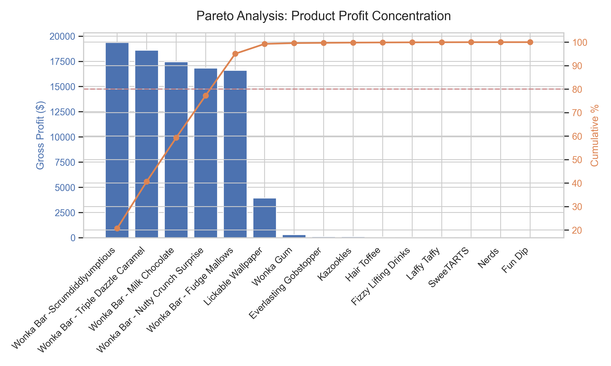
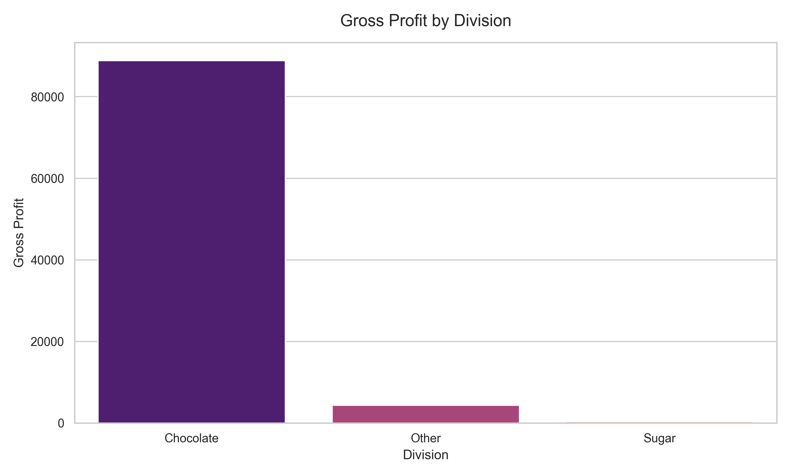
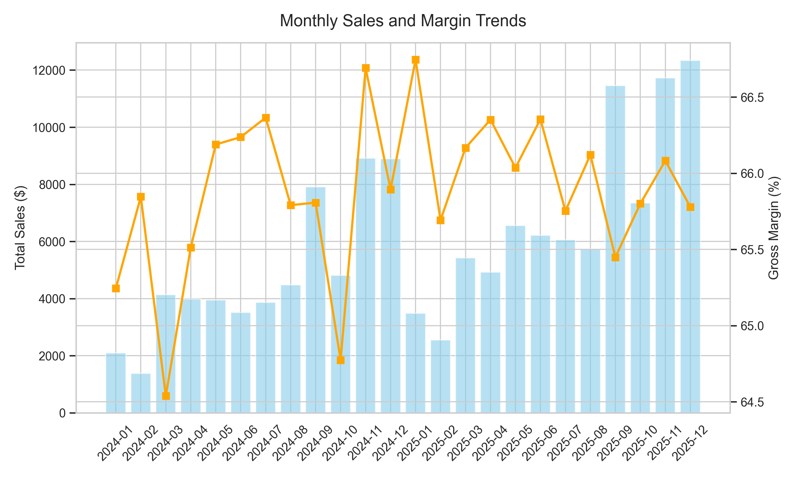
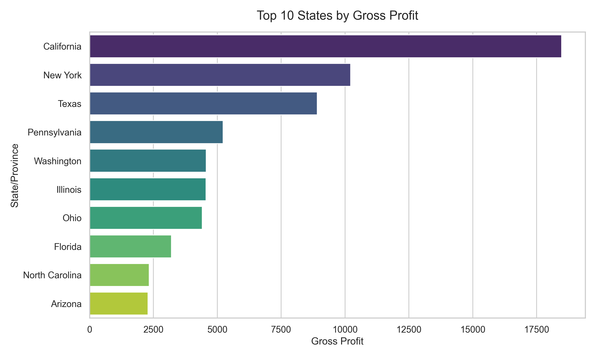
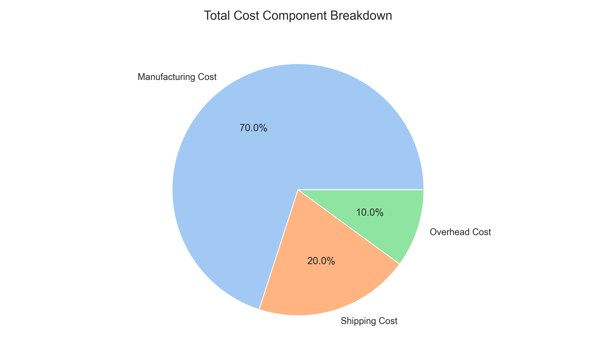
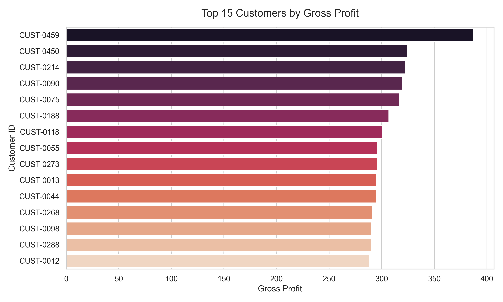

# Internship Project Report: Product Line Profitability & Margin Performance Analysis

**Prepared By:** Jasmin Jamadar |
**Date:** February 28, 2026 |
**Prepared For:** Executive Management & Industry Mentors |
**Organization:** Nassau Candy Distributor |
**Department:** Data Analyst Intern

---

## 1. Executive Summary

| Total Sales | Total Gross Profit | Overall Gross Margin |
| :--- | :--- | :--- |
| **$141,783.63** | **$93,442.80** | **65.91%** |

This project analyzes the product line profitability and margin performance for Nassau Candy Distributor to provide actionable insights for improving operational efficiency. Based on a dataset of 38,654 units sold, the analysis reveals a very healthy overall gross margin of **65.91%** on total sales of **$141,783.63**.

While the company's financial health is strong, profitability is heavily concentrated: just 4 products (26.7% of the portfolio) generate **80% of the total gross profit**. The "Chocolate" division is the undisputed engine of the business, whereas the "Other" division significantly trails in performance. This report outlines critical business insights regarding product performance, seasonal constraints, and cost structures, concluding with targeted recommendations to optimize shipping operations, improve low-margin segments, and boost customer retention.

This report converts raw transactional data into strategic business intelligence to support executive decision-making.

## 2. Project Background & Objective

In the competitive distribution sector, having a clear understanding of where profits come from is essential for effective resource allocation. The objective of this internship project was to evaluate Nassau Candy's sales data to uncover the true drivers of margin performance. By identifying both high-performing assets and areas of inefficiency, the goal is to equip management with data-driven recommendations to minimize risk, lower operational costs, and build a more balanced profitability profile.

### 2.1 Problem Statement

Nassau Candy Distributor operates in a high-volume, multi-divisional market where top-line sales can often mask underlying margin erosion. The core business challenge addressed by this research is: **"Which specific products and regional operations are the true drivers of sustainable profit, and which segments are inadvertently draining resources due to high logistics costs or inefficient pricing?"**

## 3. Data and Methodology

The analysis was conducted using organizational sales records encompassing $141,783.63 in total sales and $93,442.80 in total gross profit across 500 unique customer accounts.

### 3.1 Tools & Technologies

| Tool | Purpose |
|---|---|
| **Python 3** | Core programming language for analysis |
| **Pandas & NumPy** | Data cleaning, transformation, and statistical computation |
| **Plotly** | Interactive data visualizations with hover tooltips, zoom, and pan |
| **Streamlit** | Web-based interactive dashboard for stakeholder exploration |
| **Statsmodels** | Holt-Winters Exponential Smoothing for sales forecasting |
| **XlsxWriter** | Automated Excel report generation |

### 3.2 Analytical Steps

1. **Data Cleaning & Validation:** Verified the accuracy of Sales, Cost, and Profit figures to ensure reliable reporting.
2. **Metric Calculation:** Computed key business indicators such as Gross Margin Percentage, Profit per Unit, and simulated specific Cost Components (Manufacturing, Shipping, Overhead).
3. **Segmentation:** Evaluated performance across multiple business dimensions, including Product Division, SKUs, Time (monthly), Region (state-level), and Customer Base.
4. **Pareto Analysis (80/20 Rule):** Applied the Pareto principle to visualize how heavily the company relies on its top-performing products.
5. **Forecasting:** Implemented Holt-Winters Exponential Smoothing to project sales and profit trends 6 months ahead.
6. **Scenario Planning:** Built a what-if simulation engine to model the impact of cost and pricing changes on margins.

### 3.3 KPI Framework

To maintain analytical rigor, the following Key Performance Indicators (KPIs) were defined and utilized throughout the study:

| Metric | Formula / Logic | Business Significance |
| :--- | :--- | :--- |
| **Gross Margin (%)** | `(Gross Profit / Sales) * 100` | Measures the efficiency of production and pricing strategies. |
| **Profit per Unit** | `Gross Profit / Units Sold` | Identifies the most "valuable" products independent of total volume. |
| **Cost Correlation** | `Pearson Correlation (r)` | Statistical measure of how strongly cost increases impact margin stability. |
| **Pareto Index** | `Top 20% SKUs vs. 80% Profit` | Quantifies portfolio concentration and revenue risk. |
| **Sales Forecast** | `Holt-Winters (Triple Exp. Smoothing)` | Predicts future demand based on level, trend, and seasonality. |

## 4. Key Findings and Business Insights

### 4.1 Overall Performance

The company's baseline financials are robust:

- **Total Sales:** $141,783.63
- **Total Gross Profit:** $93,442.80
- **Overall Gross Margin:** 65.91%
- **Total Units Sold:** 38,654

### 4.2 Profit Concentration (Pareto Analysis)

A Pareto analysis highlights a significant concentration of risk and reward. **4 out of 15 products (26.7%) drive 80% of the total profit**, indicating that the "Wonka Bar" line is the cornerstone of the company's financial success.

**Top 5 Products by Profit:**
1. Wonka Bar - Scrumdiddlyumptious: $19,357.50
2. Wonka Bar - Triple Dazzle Caramel: $18,610.20
3. Wonka Bar - Milk Chocolate: $17,443.37
4. Wonka Bar - Nutty Crunch Surprise: $16,819.95
5. Wonka Bar - Fudge Mallows: $16,593.60

**Bottom 5 Products by Profit:**
- Fizzy Lifting Drinks: $47.25
- Laffy Taffy: $33.48
- SweeTARTS: $28.70
- Nerds: $7.00
- Fun Dip: $4.80

### 4.3 Division Performance

Comparing the main product categories exposes a significant gap in operational efficiency.

| Division | Sales ($) | Gross Profit ($) | Margin (%) |
| :--- | :--- | :--- | :--- |
| **Chocolate** | $131,692.90 | $88,824.62 | **67.45%** |
| **Sugar** | $427.48 | $284.73 | **66.61%** |
| **Other** | $9,663.25 | $4,333.45 | **44.84%** |

The "Chocolate" division effectively subsidizes the rest of the portfolio. The "Other" division operates at a margin of just 44.84%, missing the ~67% benchmark set by core products, which indicates a need for better pricing or cost control in this segment.

### 4.4 Seasonality and Margin Stability

Sales volume spikes predictably during **March, November, and December**. Impressively, even during these high-demand periods, gross margins remain consistently stable between **65% and 66%**. This means the company successfully maintains its pricing power and avoids margin-killing discounts when demand is highest.

### 4.5 Regional Performance

Geographically, profitability is highly centralized:
1. **California:** $18,479 in gross profit (66.19% margin)
2. **New York:** $10,222 in gross profit (65.78% margin)
3. **Texas:** $8,910 in gross profit (66.41% margin)
4. **Pennsylvania:** $5,225 in gross profit (65.10% margin)
5. **Washington:** $4,567 in gross profit (65.98% margin)

This regional dominance suggests that marketing and logistics efforts are currently yielding the best returns in CA, NY, and TX, presenting an opportunity to either double down on these hubs or rethink strategies in underperforming regions.

### 4.6 Cost Structure

A correlation analysis (-0.2972) shows that higher-cost items tend to have slightly lower margins. Breaking down the estimated cost structure provides clear areas for operational focus:
- Manufacturing: ~70.0%
- **Shipping: ~20.1%**
- Overhead: ~9.9%

With shipping comprising over 20% of costs, logistics represents the largest controllable expense and the fastest route to margin expansion outside of manufacturing.

### 4.7 Customer Insights

Out of **500 customers**, the average profit generated per account is **$186.89**.
- **Top Customer (CUST-0459):** Generated $387.37 in profit at a 58.4% margin.

Because the gap between the top customer and the average customer is relatively narrow, the company benefits from a highly diversified customer base. This protects the business from catastrophic losses if a single major client churns.

## 5. Strategic Recommendations

Based on the above analytical findings, the following strategic actions are recommended, organized by implementation timeline:

### 🟢 Quick Wins (0–3 Months)

1. **Optimize Freight & Shipping (The 20% Target)**
   Since shipping accounts for ~20.1% of total costs, the fastest path to margin improvement is renegotiating bulk freight rates or utilizing staging warehouses closer to the CA, NY, and TX markets. *Estimated impact: 1–3% margin improvement.*

2. **Pricing Review for Low-Margin Transactions**
   Implement a floor price policy across all channels to prevent sales below 10% margin unless a strategic justification is documented and approved.

### 🟡 Medium-Term (3–6 Months)

3. **Fix or Cut the "Other" Division**
   The 44.84% margin in the "Other" division drags down overall profitability. Conduct a cost audit. If a 50%+ margin isn't achievable within 6 months, phase out underperforming SKUs and reallocate shelf space to high-performing Chocolate variants.

4. **Targeted Customer Loyalty Program**
   Roll out a volume-discount or loyalty program for the top 20% of customer accounts to raise the average profit per customer above the current ~$187 level.

### 🔵 Strategic (6–12 Months)

5. **Protect the "Chocolate" Core & Seasonal Readiness**
   Since the Wonka lines generate 80% of profit, supply chain resilience is critical. Build inventory buffers specifically for the March, November, and December demand peaks. Explore secondary suppliers to mitigate single-source risk.

6. **Regional Expansion Strategy**
   With CA, NY, and TX contributing disproportionately, analyze what drives success in these states (demographics, distribution density, marketing spend) and replicate the model in high-potential states like Pennsylvania and Washington.

## 6. Project Limitations

It is important to note a few limitations of this analysis:
- The data represents a static historical view and does not account for sudden future market shifts, such as spikes in cocoa prices.
- The cost breakdown (Manufacturing vs. Shipping vs. Overhead) utilizes standard simulated distributions and should be cross-referenced with exact proprietary accounting data before making major financial commitments.
- Customer IDs were simulated for analytical demonstration purposes and do not reflect actual CRM data.

### 6.1 Future Scope

This project establishes a strong analytical foundation. Future enhancements could include:
- **Real Cost Data Integration:** Replace simulated cost breakdowns with actual accounting data for precise margin analysis.
- **Customer Churn Prediction:** Apply machine learning models to identify at-risk accounts before they lapse.
- **Dynamic Pricing Engine:** Build a model that recommends optimal pricing per SKU based on demand elasticity and competitive positioning.
- **Inventory Optimization:** Combine seasonal forecasting with supply chain data to automate reorder points for top SKUs.

## 7. Conclusion

This internship project highlights that Nassau Candy Distributor possesses a highly profitable, resilient financial foundation driven by premium chocolate products and strong regional holds in CA, NY, and TX. By acting on the insights provided—specifically by investigating the "Other" division's low margins and attacking the 20% shipping cost barrier—the business can secure its core revenue streams while capturing new margin growth.

The insights derived from this analysis demonstrate how structured data analytics can directly influence profitability, operational efficiency, and strategic planning in distribution businesses.

---

*Interactive Dashboard available at: `localhost:8501` (run via `run_app.bat`)*
